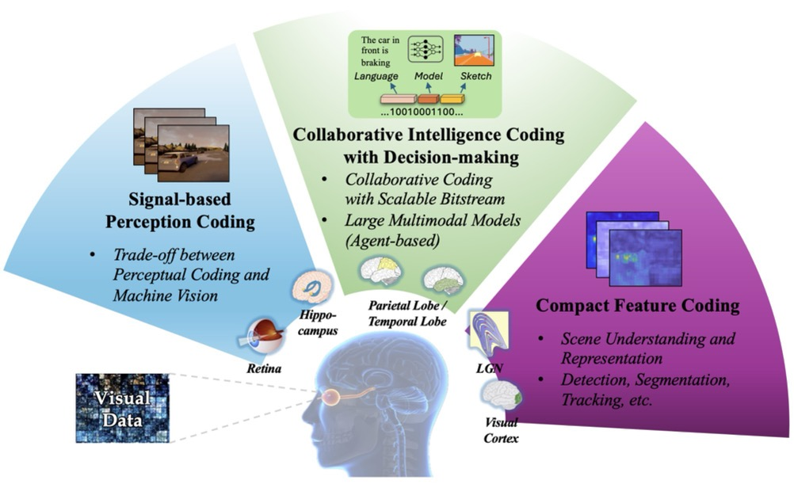

# Awesome_VCM
Paper list of visual data compression for machines, including image/video coding for machines, feature compression, collaborative coding, point cloud compression for machines and image/video coding for machines with large multimodal models. 

**Maintained by:** [Lingyu Zhu](https://scholar.google.com/citations?user=IhyTEDkAAAAJ&hl=zh-CN) and [Peilin Chen](https://scholar.google.com/citations?user=b9k152sAAAAJ&hl=zh-CN)

# Overview

# Notes
- If you find papers relevant to this topic, please share them as a discussion post.
- Some papers may simultaneously belong to multiple subfields, and we categorize them accordingly to reflect these overlaps.
- Looking forward to your kind contributions and discussions! Many thanks!

# Updated on 2024.11.19

  
Table of Contents

  <ol>
    <li><a href=#Image/Video Coding for Machines>Image/Video Coding for Machines</a></li>
    <li><a href=#Feature Compression>Feature Compression</a></li>
    <li><a href=#Collaborative Coding>Collaborative Coding</a></li>
    <li><a href=#Point Cloud Compression for Machines>Point Cloud for Machines</a></li>
    <li><a href=#Image/Video Coding Meets Large Multimodal Models>Image/Video Coding Meets Large Multimodal Models</a></li>
  </ol>

## Image/Video Coding for Machines

|Publish Date|Title|Authors|PDF|Code|
|---|---|---|---|---|
|**2021.08**|**Digital Retina: A Way to Make the City Brain More Efficient by Visual Coding**|Wen Gao et.al.|[TCSVT](https://ieeexplore.ieee.org/abstract/document/9514562)|null|
|**2024.11**|**Compact Visual Data Representation for Green Multimedia - A Human Visual System Perspective**|Peilin Chen et.al.|[2411.14135](https://arxiv.org/pdf/2411.14135)|null|
|**2024.08**|**Preprocessing Enhanced Image Compression for Machine Vision**|Guo Lu et.al.|[TCSVT](https://ieeexplore.ieee.org/abstract/document/10632166)|null|
|**2024.08**|**A coding framework and benchmark towards low-bitrate video understanding**|Yuan Tian et.al.|[TPAMI](https://ieeexplore.ieee.org/stamp/stamp.jsp?tp=&arnumber=10440520)|null|
|**2024.08**|**Privacy-Preserving Autoencoder for Collaborative Object Detection**|Bardia Azizian et.al.|[TIP](https://ieeexplore.ieee.org/stamp/stamp.jsp?arnumber=10667003)|null|
|**2024.07**|**Task-Switchable Pre-Processor for Image Compression for Multiple Machine Vision Tasks**|Mingyi Yang et.al.|[TCSVT](https://ieeexplore.ieee.org/stamp/stamp.jsp?arnumber=10379180)|null|
|**2024.07**|**Region-of-Interest-Based Video Coding for Machines**|Olgierd Stankiewicz et.al.|[ICMEW](https://ieeexplore.ieee.org/abstract/document/10645441)|null|
|**2024.07**|**Vnvc: A versatile neural video coding framework for efficient human-machine vision**|Xihua Sheng et.al.|[TPAMI](https://ieeexplore.ieee.org/stamp/stamp.jsp?arnumber=10411051)|null|
|**2024.07**|**Video Coding for Machines: Compact Visual Representation Compression for Intelligent Collaborative Analytics**|Wenhan Yang et.al.|[TPAMI](https://ieeexplore.ieee.org/stamp/stamp.jsp?tp=&arnumber=10440522)|null|
|**2024.07**|**Rate-Distortion-Cognition Controllable Versatile Neural Image Compression**|Jinming Liu et.al.|[2407.11700](https://arxiv.org/abs/2407.11700)|null|
|**2024.06**|**On Annotation-free Optimization of Video Coding for Machines**|Marc Windsheimer et.al.|[2406.07938](https://arxiv.org/abs/2406.07938)|null|
|**2024.06**|**SMC++: Masked Learning of Unsupervised Video Semantic Compression**|Yuan Tian et.al.|[2406.04765](https://arxiv.org/pdf/2406.04765)|null|
|**2024.06**|**Machine Perception-Driven Facial Image Compression: A Layered Generative Approach**|Yuefeng Zhang et.al.|[TCSVT](https://ieeexplore.ieee.org/stamp/stamp.jsp?arnumber=10570244)|null|
|**2024.06**|**Human–Machine Collaborative Image Compression Method Based on Implicit Neural Representation**|Huanyang Li et.al.|[J EM SEL TOP C](https://ieeexplore.ieee.org/stamp/stamp.jsp?arnumber=10495030)|null|
|**2024.05**|**Privacy-preserving with Flexible Autoencoder for Video Coding for Machines**|Aorui Gou et.al.|[ISCAS](https://ieeexplore.ieee.org/stamp/stamp.jsp?arnumber=10558330)|null|
|**2024.04**|**Deep Video Codec Control for Vision Model**|Christoph Reich et.al.|[2308.16215](https://arxiv.org/pdf/2308.16215)|null|
|**2024.04**|**A Perspective on Deep Vision Performance with Standard Image and Video Codecs**|Christoph Reich et.al.|[CVPRW](https://openaccess.thecvf.com/content/CVPR2024W/AI4Streaming/papers/Reich_A_Perspective_on_Deep_Vision_Performance_with_Standard_Image_and_CVPRW_2024_paper.pdf)|null|
|**2024.04**|**Task-Aware Encoder Control for Deep Video Compression**|Xingtong Ge et.al.|[CVPR](https://openaccess.thecvf.com/content/CVPR2024/papers/Ge_Task-Aware_Encoder_Control_for_Deep_Video_Compression_CVPR_2024_paper.pdf)|null|
|**2023.12**|**Image Coding for Machines based on Non-Uniform Importance Allocation**|Yunpeng Qi et.al.|[VCIP](https://ieeexplore.ieee.org/abstract/document/10402758)|null|
|**2023.12**|**Scalable Face Image Coding via StyleGAN Prior: Towards Compression for Human-Machine Collaborative Vision**|Qi Mao et.al.|[TIP](https://ieeexplore.ieee.org/stamp/stamp.jsp?arnumber=10372532)|null|
|**2023.12**|**Pixel-level Texture Segmentation Based AV1 Video Compression**|Zixiang Zhang et.al.|[VCIP](https://ieeexplore.ieee.org/abstract/document/10402607)|null|
|**2023.10**|**Sketch Assisted Face Image Coding for Human and Machine Vision: A Joint Training Approach**|Xin Fang et.al.|[TCSVT](https://ieeexplore.ieee.org/abstract/document/10082973)|null|
|**2023.10**|**Deepsvc: Deep scalable video coding for both machine and human vision**|Hongbin Lin et.al.|[ACM MM](https://dl.acm.org/doi/abs/10.1145/3581783.3612500)|null|
|**2023.10**|**ICMH-Net: Neural Image Compression Towards both Machine Vision and Human Vision**|Lei Liu et.al.|[ACM MM](https://dl.acm.org/doi/abs/10.1145/3581783.3612041)|null|
|**2023.10**|**Video Object Detection From Compressed Formats for Modern Lightweight Consumer Electronics**|Sangeeta Yadav et.al.|[TCE](https://ieeexplore.ieee.org/abstract/document/10287576)|null|
|**2023.08**|**Unified Architecture Adaptation for Compressed Domain Semantic Inference**|Zhihao Duan et.al.|[TCSVT](https://ieeexplore.ieee.org/stamp/stamp.jsp?arnumber=10029924)|null|
|**2023.06**|**Semantic Preprocessor for Image Compression for Machines**|Mingyi Yang et.al.|[ICASSP](https://ieeexplore.ieee.org/abstract/document/10096472)|null|
|**2023.05**|**Rate-Distortion Theory in Coding for Machines and its Application**|Alon Harell et.al.|[2305.17295](https://arxiv.org/abs/2305.17295)|null|
|**2023.05**|**Prompt-icm: A unified framework towards image coding for machines with task-driven prompts**|Ruoyu Feng et.al.|[2305.02578](https://arxiv.org/abs/2305.02578)|null|
|**2023.05**|**Fast VVC Intra Encoding for Video Coding for Machines**|Aorui Gou et.al.|[ISCAS](https://ieeexplore.ieee.org/abstract/document/10181507)|null|
|**2022.12**|**Semantic Segmentation In Learned Compressed Domain**|Jinming Liu et.al.|[PCS](https://ieeexplore.ieee.org/abstract/document/10018036)|null|
|**2022.08**|**Improving Multiple Machine Vision Tasks in the Compressed Domain**|Jinming Liu et.al.|[ICPR](https://ieeexplore.ieee.org/abstract/document/9956532)|null|
|**2022.03**|**Scalable Image Coding for Humans and Machines**|Hyomin Choi et.al.|[TIP](https://ieeexplore.ieee.org/abstract/document/9741390)|null|
|**2021.09**|**Analysis Of Neural Image Compression Networks For Machine-To-Machine Communication**|Kristian Fischer et.al.|[ICIP](https://ieeexplore.ieee.org/abstract/document/9506763)|null|
|**2021.07**|**Thousand to One: Semantic Prior Modeling for Conceptual Coding**|Jianhui Chang et.al.|[ICME](https://ieeexplore.ieee.org/abstract/document/9428366)|null|
|**2021.07**|**Visual Analysis Motivated Rate-Distortion Model for Image Coding**|Zhimeng Huang et.al.|[ICME](https://ieeexplore.ieee.org/abstract/document/9428417)|null|
|**2021.07**|**Learned Image Coding for Machines: A Content-Adaptive Approach**|Nam Le et.al.|[ICME](https://ieeexplore.ieee.org/abstract/document/9428224)|null|
|**2021.05**|**Robust Deep Neural Object Detection and Segmentation for Automotive Driving Scenario with Compressed Image Data**|Kristian Fischer et.al.|[ISCAS](https://ieeexplore.ieee.org/abstract/document/9401621)|null|
|**2021.05**|**End-to-end optimized image compression for machines, a study**|Lahiru D. Chamain et.al.|[DCC](https://ieeexplore.ieee.org/stamp/stamp.jsp?arnumber=9418723)|null|
|**2021.05**|**Collaborative Intelligence: Challenges and Opportunities**|Ivan V. Bajić et.al.|[ICASSP](https://ieeexplore.ieee.org/abstract/document/9413943)|null|
|**2021.05**|**Recent Standard Development Activities on Video Coding for Machines**|Wen Gao et.al.|[2105.12653](https://arxiv.org/abs/2105.12653)|null|
|**2021.05**|**Image Coding For Machines: an End-To-End Learned Approach**|Nam Le et.al.|[ICASSP](https://ieeexplore.ieee.org/abstract/document/9414465)|null|
|**2021.05**|**Saliency-Driven Versatile Video Coding for Neural Object Detection**|Kristian Fischer et.al.|[ICASSP](https://ieeexplore.ieee.org/abstract/document/9415048)|null|
|**2021.03**|**Towards Coding for Human and Machine Vision: Scalable Face Image Coding**|Shuai Yang et.al.|[TMM](https://ieeexplore.ieee.org/abstract/document/9385898)|null|
|**2021.02**|**Pareto-Optimal Bit Allocation for Collaborative Intelligence**|Saeed Ranjbar Alvar et.al.|[TIP](https://ieeexplore.ieee.org/abstract/document/9364873)|null|
|**2020.11**|**Task-Aware Quantization Network for JPEG Image Compression**|Jinyoung Choi et.al.|[ECCV](https://link.springer.com/chapter/10.1007/978-3-030-58565-5_19)|null|
|**2020.10**|**Semantic-Preserving Image Compression**|Neel Patwa et.al.|[ICIP](https://ieeexplore.ieee.org/abstract/document/9191247)|null|
|**2020.10**|**On Intra Video Coding And In-Loop Filtering For Neural Object Detection Networks**|Kristian Fischer et.al.|[ICIP](https://ieeexplore.ieee.org/abstract/document/8682641)|null|
|**2020.08**|**Video Coding for Machines: A Paradigm of Collaborative Compression and Intelligent Analytics**|Lingyu Duan et.al.|[TIP](https://ieeexplore.ieee.org/abstract/document/9180095)|null|
|**2020.07**|**Towards Coding For Human And Machine Vision: A Scalable Image Coding Approach**|Yueyu Hu et.al.|[ICME](https://ieeexplore.ieee.org/abstract/document/9102750)|null|
|**2020.06**|**Image Compression With Encoder-Decoder Matched Semantic Segmentation**|Trinh Man Hoang et.al.|[CVPRW](https://openaccess.thecvf.com/content_CVPRW_2020/html/w7/Hoang_Image_Compression_With_Encoder-Decoder_Matched_Semantic_Segmentation_CVPRW_2020_paper.html)|null|
|**2020.05**|**Back-And-Forth Prediction for Deep Tensor Compression**|Hyomin Choi et.al.|[ICASSP](https://ieeexplore.ieee.org/abstract/document/9053011)|null|
|**2020.05**|**Binary Probability Model for Learning Based Image Compression**|Théo LADUNE et.al.|[ICASSP](https://ieeexplore.ieee.org/abstract/document/9053997)|null|
|**2020.05**|**Bit Allocation for Multi-Task Collaborative Intelligence**|Saeed Ranjbar Alvar et.al.|[ICASSP](https://ieeexplore.ieee.org/abstract/document/9054770)|null|
|**2020.01**|**Towards Efficient Front-End Visual Sensing for Digital Retina: A Model-Centric Paradigm**|Yihang Lou et.al.|[TMM](https://ieeexplore.ieee.org/abstract/document/8960464)|null|
|**2019.10**|**AdaCompress: Adaptive Compression for Online Computer Vision Services**|Hongshan Li et.al.|[ACM MM](https://dl.acm.org/doi/abs/10.1145/3343031.3350874)|null|
|**2019.08**|**Multi-Task Learning with Compressible Features for Collaborative Intelligence**|Saeed Ranjbar Alvar et.al.|[ICIP](https://ieeexplore.ieee.org/abstract/document/8803110)|null|
|**2019.08**|**Image Pre-Transformation for Recognition-Aware Image Compression**|Satoshi Suzuki et.al.|[ICIP](https://ieeexplore.ieee.org/abstract/document/8803275)|null|
|**2019.08**|**Layered conceptual image compression via deep semantic synthesis**|Jianhui Chang et.al.|[ICIP](https://ieeexplore.ieee.org/abstract/document/8803805)|null|
|**2019.05**|**DSSLIC: Deep Semantic Segmentation-based Layered Image Compression**|Mohammad Akbari et.al.|[ICASSP](https://ieeexplore.ieee.org/abstract/document/8683541)|null|
|**2019.05**|**Pixel-level Texture Segmentation Based AV1 Video Compression**|Di Chen et.al.|[ICASSP](https://ieeexplore.ieee.org/abstract/document/8682641)|null|

## Feature Compression

|Publish Date|Title|Authors|PDF|Code|
|---|---|---|---|---|
|**2024.05**|**Split Computing With Scalable Feature Compression for Visual Analytics on the Edge**|Zhongzheng Yuan et.al.|[TMM](https://ieeexplore.ieee.org/stamp/stamp.jsp?arnumber=10540267)|null|
|**2024.04**|**Hierarchical Image Feature Compression for Machines via Feature Sparsity Learning**|Ding Ding et.al.|[SPL](https://ieeexplore.ieee.org/stamp/stamp.jsp?arnumber=10540267)|null|
|**2023.07**|**Residual based hierarchical feature compression for multi-task machine vision**|Chaoran Chen et.al.|[ICME](https://ieeexplore.ieee.org/abstract/document/10219664)|null|
|**2023.06**|**Learnt mutual feature compression for machine vision**|Tie Liu et.al.|[ICASSP](https://ieeexplore.ieee.org/abstract/document/10094830)|null|
|**2021.07**|**Rate-Distortion Optimized Hierarchical Deep Feature Compression**|Ademola Ikusan et.al.|[ICME](https://ieeexplore.ieee.org/abstract/document/9428228)|null|
|**2021.06**|**MSFC: Deep Feature Compression in Multi-Task Network**|Zhicong Zhang et.al.|[ICME](https://ieeexplore.ieee.org/abstract/document/9428258)|null|
|**2021.06**|**Semantics-to-Signal Scalable Image Compression with Learned Revertible Representations**|Kang Liu et.al.|[IJCV](https://link.springer.com/article/10.1007/s11263-021-01491-7)|null|
|**2021.02**|**Pareto-Optimal Bit Allocation for Collaborative Intelligence**|Saeed Ranjbar Alvar et.al.|[TIP](https://ieeexplore.ieee.org/abstract/document/9364873)|null|
|**2020.12**|**Sensitivity-Aware Bit Allocation for Intermediate Deep Feature Compression**|Yuzhang Hu et.al.|[VCIP](https://ieeexplore.ieee.org/abstract/document/9301807))|null|
|**2020.10**|**End-to-End Learning of Compressible Features**|Saurabh Singh et.al.|[ICIP](https://ieeexplore.ieee.org/abstract/document/9190860)|null|
|**2020.10**|**Data Representation in Hybrid Coding Framework for Feature Maps Compression**|Zhuo Chen et.al.|[ICIP](https://ieeexplore.ieee.org/stamp/stamp.jsp?tp=&arnumber=9190843)|null|
|**2020.10**|**Deep Feature Compression With Spatio-Temporal Arranging for Collaborative Intelligence**|Satoshi Suzuki et.al.|[ICIP](https://ieeexplore.ieee.org/abstract/document/9190933)|null|
|**2020.07**|**Object-Based Image Coding: A Learning-Driven Revisit**|Qi Xia et.al.|[ICME](https://ieeexplore.ieee.org/abstract/document/9102810)|null|
|**2020.07**|**An Emerging Coding Paradigm Vcm: A Scalable Coding Approach Beyond Feature And Signal**|Sifeng Xia et.al.|[ICME](https://ieeexplore.ieee.org/abstract/document/9102843)|null|
|**2020.05**|**Deriving Compact Feature Representations Via Annealed Contraction**|Muhammad A. Shah et.al.|[ICASSP](https://ieeexplore.ieee.org/abstract/document/9054527)|null|
|**2020.05**|**Bit Allocation for Multi-Task Collaborative Intelligence**|Saeed Ranjbar Alvar et.al.|[ICASSP](https://ieeexplore.ieee.org/abstract/document/9054770)|null|
|**2020.03**|**Binary Representation and High Efficient Compression of 3D CNN Features for Action Recognition**|Peiyin Xing et.al.|[DCC](https://ieeexplore.ieee.org/abstract/document/9105757)|null|
|**2019.10**|**Lossy Intermediate Deep Learning Feature Compression and Evaluation**|Zhuo Chen et.al.|[ACM MM](https://dl.acm.org/doi/abs/10.1145/3343031.3350849)|null|
|**2019.09**|**Toward Intelligent Sensing: Intermediate Deep Feature Compression**|Zhuo Chen et.al.|[TIP](https://ieeexplore.ieee.org/abstract/document/8848858)|null|
|**2019.09**|**Semantically Scalable Image Coding With Compression of Feature Maps**|Ning Yan et.al.|[ICIP](https://ieeexplore.ieee.org/abstract/document/9191184)|null|
|**2019.08**|**Multi-Task Learning with Compressible Features for Collaborative Intelligence**|Saeed Ranjbar Alvar et.al.|[ICIP](https://ieeexplore.ieee.org/abstract/document/8803110)|null|
|**2019.05**|**Pixel-level Texture Segmentation Based AV1 Video Compression**|Di Chen et.al.|[ICASSP](https://ieeexplore.ieee.org/abstract/document/8682641)|null|

## Collaborative Coding

|Publish Date|Title|Authors|PDF|Code|
|---|---|---|---|---|
|**2024.07**|**Vnvc: A versatile neural video coding framework for efficient human-machine vision**|Xihua Sheng et.al.|[TPAMI](https://ieeexplore.ieee.org/stamp/stamp.jsp?arnumber=10411051)|null|
|**2024.06**|**Human–Machine Collaborative Image Compression Method Based on Implicit Neural Representation**|Huanyang Li et.al.|[J EM SEL TOP C](https://ieeexplore.ieee.org/stamp/stamp.jsp?arnumber=10495030)|null|
|**2024.02**|**Scalable Human-Machine Point Cloud Compression**|Mateen Ulhaq et.al.|[PCS](https://arxiv.org/pdf/2402.12532)|null|
|**2023.12**|**Scalable Face Image Coding via StyleGAN Prior: Towards Compression for Human-Machine Collaborative Vision**|Qi Mao et.al.|[TIP](https://ieeexplore.ieee.org/stamp/stamp.jsp?arnumber=10372532)|null|
|**2023.10**|**Sketch Assisted Face Image Coding for Human and Machine Vision: A Joint Training Approach**|Xin Fang et.al.|[TCSVT](https://ieeexplore.ieee.org/abstract/document/10082973)|null|
|**2023.10**|**Deepsvc: Deep scalable video coding for both machine and human vision**|Hongbin Lin et.al.|[ACM MM](https://dl.acm.org/doi/abs/10.1145/3581783.3612500)|null|
|**2023.10**|**ICMH-Net: Neural Image Compression Towards both Machine Vision and Human Vision**|Lei Liu et.al.|[ACM MM](https://dl.acm.org/doi/abs/10.1145/3581783.3612041)|null|
|**2021.06**|**Semantics-to-Signal Scalable Image Compression with Learned Revertible Representations**|Kang Liu et.al.|[IJCV](https://link.springer.com/article/10.1007/s11263-021-01491-7)|null|
|**2021.06**|**Towards Analysis-Friendly Face Representation With Scalable Feature and Texture Compression**|Shurun Wang et.al.|[TCSVT](https://ieeexplore.ieee.org/abstract/document/9473014)|null|
|**2021.05**|**Teacher-Student Learning With Multi-Granularity Constraint Towards Compact Facial Feature Representation**|Shurun Wang et.al.|[ICASSP](https://ieeexplore.ieee.org/abstract/document/9413506)|null|
|**2021.03**|**Towards Coding for Human and Machine Vision: Scalable Face Image Coding**|Shuai Yang et.al.|[TMM](https://ieeexplore.ieee.org/abstract/document/9385898)|null|
|**2021.02**|**Pareto-Optimal Bit Allocation for Collaborative Intelligence**|Saeed Ranjbar Alvar et.al.|[TIP](https://ieeexplore.ieee.org/abstract/document/9364873)|null|
|**2020.07**|**Towards Coding For Human And Machine Vision: A Scalable Image Coding Approach**|Yueyu Hu et.al.|[ICME](https://ieeexplore.ieee.org/abstract/document/9102750)|null|
|**2020.07**|**An Emerging Coding Paradigm Vcm: A Scalable Coding Approach Beyond Feature And Signal**|Sifeng Xia et.al.|[ICME](https://ieeexplore.ieee.org/abstract/document/9102843)|null|
|**2020.05**|**Bit Allocation for Multi-Task Collaborative Intelligence**|Saeed Ranjbar Alvar et.al.|[ICASSP](https://ieeexplore.ieee.org/abstract/document/9054770)|null|
|**2019.08**|**Multi-Task Learning with Compressible Features for Collaborative Intelligence**|Saeed Ranjbar Alvar et.al.|[ICIP](https://ieeexplore.ieee.org/abstract/document/8803110)|null|
|**2019.08**|**Scalable Facial Image Compression with Deep Feature Reconstruction**|Shurun Wang et.al.|[ICIP](https://ieeexplore.ieee.org/abstract/document/8803255)|null|
|**2019.05**|**Pixel-level Texture Segmentation Based AV1 Video Compression**|Di Chen et.al.|[ICASSP](https://ieeexplore.ieee.org/abstract/document/8682641)|null|

## Point Cloud Compression for Machines

|Publish Date|Title|Authors|PDF|Code|
|---|---|---|---|---|
|**2024.07**|**Towards Point Cloud Compression for Machine Perception: A Simple and Strong Baseline by Learning the Octree Depth Level Predictor**|Lei Liu et.al.|[IJCAI](https://link.springer.com/chapter/10.1007/978-981-97-6125-8_1)|null|
|**2024.02**|**Scalable Human-Machine Point Cloud Compression**|Mateen Ulhaq et.al.|[PCS](https://arxiv.org/pdf/2402.12532)|null|
|**2023.10**|**Deep learning-based compressed domain point cloud classification**|Abdelrahman Seleem et.al.|[ICIP](https://ieeexplore.ieee.org/stamp/stamp.jsp?arnumber=10222160)|null|

## Image/Video Coding Meets Large Multimodal Models

|Publish Date|Title|Authors|PDF|Code|
|---|---|---|---|---|
|**2024.11**|**Large Language Models for Lossless Image Compression: Next-Pixel Prediction in Language Space is All You Need**|Kecheng Chen et.al.|[2411.12448](https://arxiv.org/pdf/2411.12448)|null|
|**2024.10**|**High Efficiency Image Compression for Large Visual-Language Models**|Binzhe Li et.al.|[TCSVT](https://ieeexplore.ieee.org/abstract/document/10738826)|null|
|**2024.08**|**Tell Codec What Worth Compressing: Semantically Disentangled Image Coding for Machine with LMMs**|Jinming Liu et.al.|[2408.08575](https://arxiv.org/pdf/2408.08575)|null|
|**2024.08**|**When Video Coding Meets Multimodal Large Language Models: A Unified Paradigm for Video Coding**|Pingping Zhang et.al.|[2408.08093](https://arxiv.org/pdf/2408.08093)|null|
|**2024.07**|**ComNeck: Bridging Compressed Image Latents and Multimodal LLMs via Universal Transform-Neck**|Chia-Hao Kao et.al.|[2407.19651](https://arxiv.org/pdf/2407.19651)|null|

